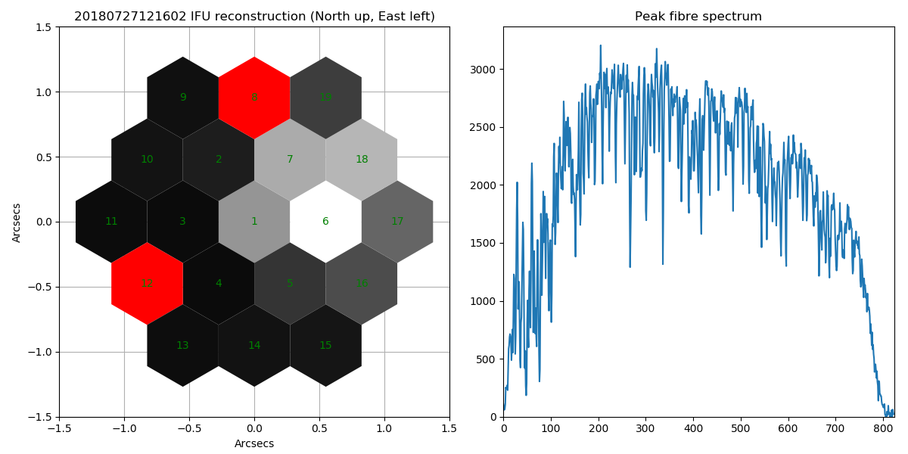

# PRAXIS Viewer

This programme is a quick look viewer for PRAXIS data. If produces a reconstructed IFU image to help
with target acquistion and does a simple extraction of a spectrum from the science fibres.

## Requirements

### Python libraries (essential)

In addition to Python this programme requires the `numpy`. `astropy` & `matplotlib` Python
libraries. These can be installed with the operating system's package manager, `conda`, HomeBrew or
```
pip install -r requirements.txt
```

### Environment variable (recommended)

It is possible to reduce the amount of typing required by setting the `$PRAXIS` environment variable
to the path of the directory that contains the PRAXIS exposures, e.g.
```
export PRAXIS=/run/user/1234/gvfs/smb-share:server=127.0.0.1,share=hxrg/H2RG-C001-ASIC-SC2-B-010-JWST/FSRamp
```
Add this to your `~.bashrc`/`.zshrc` file to automatically set `$PRAXIS` in every new shell.

## Usage

To run the PRAXIS viewer on the most recent image:
```
./PRAXIS_viewer.py
```
A window will appear with the reconstructed IFU image and the combined spectrum from the 7 science fibres. To continue close the window. The IFU image is normalised by the flux in the brightest fibre. **Note, automatic location of the latest image requires the `$PRAXIS` environment variable to have been set.**

To run on the most recent image with sky subtraction:
```
./PRAXIS_viewer.py --subtract 20180727103250
```
This will subtract the image taken at a datetime of `20180727103250` from the most recent image
before doing the IFU image reconstruction.

Multiple datetimes/filenames can be given. If three are more are given the data from each will be median combined before processing, while if only two are given the mean is used.

If `$PRAXIS` is not set, or if you want to use a sky image that is not in the PRAXIS raw data
directory then the full path must be given:
```
./PRAXIS_viewer.py --subtract ~praxis/stuff/sky_10_seconds.fits
```

To run on an earlier image specify its datetime:
```
./PRAXIS_viewer.py --filenames 20180727121602 --subtract 20180727103250
```

Multiple datetimes/filenames can be given. If three are more are given the data from each will be median combined before processing, while if only two are given the mean is used.

If cosmic rays are effecting the extracted science spectrum then sigma clipping can be used when
combining the spectra from the 7 science fibres.

```
./PRAXIS_viewer.py --filenames 20190715180858 20190715183401 --subtract 20190715181736 20190715182527 --sigmaclip 2.5
```

To list other options:
```
./PRAXIS_viewer.py --help
```

## Example output


